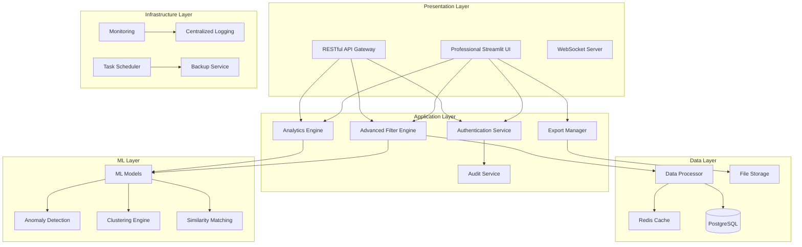

# Design Document

## Overview

This design document outlines the architectural transformation of the Flex Property Filter Dashboard from a basic Streamlit application into an enterprise-grade production system. The design maintains the core property filtering functionality while adding professional architecture, advanced security, ML-powered features, and production-ready capabilities.

The transformation follows enterprise software patterns including microservices architecture, dependency injection, comprehensive security layers, and scalable data processing pipelines. The system will support role-based access control, advanced analytics, API integrations, and production deployment with monitoring and compliance features.

## Architecture

### High-Level Architecture



### Component Architecture

The system follows a layered architecture with clear separation of concerns:

1. **Presentation Layer**: Professional UI and API interfaces
2. **Application Layer**: Business logic and service orchestration
3. **Data Layer**: Data processing, caching, and persistence
4. **ML Layer**: Machine learning algorithms and models
5. **Infrastructure Layer**: Monitoring, logging, and operational services

### Technology Stack

- **Frontend**: Streamlit with custom CSS and professional components
- **Backend**: Python with FastAPI for API services
- **Database**: PostgreSQL for structured data, Redis for caching
- **ML Framework**: scikit-learn, pandas, numpy
- **Authentication**: OAuth2/SAML with JWT tokens
- **Monitoring**: Prometheus, Grafana, structured logging
- **Deployment**: Docker containers with Kubernetes orchestration

## Components and Interfaces

### 1. Authentication Component (`app/components/authentication.py`)

**Purpose**: Manages user authentication, authorization, and session management

**Key Features**:
- Multi-provider authentication (OAuth2, SAML, LDAP)
- Role-based access control (Admin, Analyst, Viewer)
- Secure session management with JWT tokens
- Password policies and MFA support

**Interface**:
```python
class AuthenticationComponent:
    def authenticate_user(self, credentials: Dict) -> AuthResult
    def authorize_action(self, user: User, action: str) -> bool
    def get_current_user(self) -> User
    def logout(self) -> None
    def refresh_token(self, token: str) -> str
```

### 2. Advanced Data Processor (`app/components/data_processor.py`)

**Purpose**: Handles intelligent data processing, validation, and transformation

**Key Features**:
- Comprehensive data validation with quality scoring
- Fuzzy column matching and mapping suggestions
- Automatic data cleaning and outlier detection
- Smart caching with data fingerprinting
- Processing audit trails

**Interface**:
```python
class DataProcessor:
    def process_upload(self, file) -> Tuple[DataFrame, ProcessingReport]
    def validate_structure(self, df: DataFrame) -> ValidationResult
    def clean_and_transform(self, df: DataFrame) -> DataFrame
    def generate_quality_report(self, df: DataFrame) -> QualityReport
    def suggest_column_mapping(self, df: DataFrame) -> MappingResult
```

### 3. ML-Powered Filter Engine (`app/components/filter_engine.py`)

**Purpose**: Provides advanced filtering with machine learning capabilities

**Key Features**:
- Traditional rule-based filtering
- ML-powered anomaly detection using Isolation Forest
- Property clustering for market segmentation
- Similarity matching based on property characteristics
- AI-powered filter recommendations

**Interface**:
```python
class AdvancedFilterEngine:
    def apply_smart_filters(self, df: DataFrame, preferences: Dict) -> DataFrame
    def apply_ml_filters(self, df: DataFrame, preferences: Dict) -> DataFrame
    def remove_anomalies(self, df: DataFrame) -> DataFrame
    def find_similar_properties(self, df: DataFrame, reference: Dict) -> DataFrame
    def get_filter_recommendations(self, df: DataFrame) -> RecommendationResult
```

### 4. Analytics Dashboard (`app/components/analytics_dashboard.py`)

**Purpose**: Generates comprehensive analytics and visualizations

**Key Features**:
- Interactive charts and visualizations using Plotly
- Market segmentation analysis
- Performance metrics and KPIs
- Trend analysis and forecasting
- Geographic distribution mapping

**Interface**:
```python
class AnalyticsDashboard:
    def generate_market_analysis(self, df: DataFrame) -> AnalysisResult
    def create_performance_metrics(self, df: DataFrame) -> MetricsResult
    def build_geographic_visualization(self, df: DataFrame) -> PlotlyFigure
    def calculate_trend_analysis(self, df: DataFrame) -> TrendResult
    def generate_risk_assessment(self, df: DataFrame) -> RiskResult
```

### 5. Export Manager (`app/components/export_manager.py`)

**Purpose**: Handles data export with enhanced metadata and multiple formats

**Key Features**:
- Multiple export formats (CSV, Excel, PDF, JSON)
- Enhanced metadata inclusion
- Export scheduling and automation
- Audit trail for all exports
- Compression and encryption options

**Interface**:
```python
class ExportManager:
    def export_data(self, df: DataFrame, format: str, options: Dict) -> ExportResult
    def schedule_export(self, config: ExportConfig) -> ScheduleResult
    def generate_report(self, df: DataFrame, template: str) -> ReportResult
    def track_export_history(self, user: User) -> List[ExportRecord]
```

### 6. Session Manager (`app/utils/session_manager.py`)

**Purpose**: Manages user sessions and application state

**Key Features**:
- Secure session storage
- State persistence across requests
- Session timeout management
- Multi-tab support
- Session analytics

**Interface**:
```python
class SessionManager:
    def create_session(self, user: User) -> Session
    def get_session_state(self, session_id: str) -> SessionState
    def update_session_state(self, session_id: str, state: Dict) -> None
    def cleanup_expired_sessions(self) -> None
```

### 7. Cache Manager (`app/utils/cache_manager.py`)

**Purpose**: Intelligent caching for performance optimization

**Key Features**:
- Data fingerprinting for cache keys
- Automatic cache invalidation
- Memory and Redis-based caching
- Cache hit/miss analytics
- Configurable TTL policies

**Interface**:
```python
class CacheManager:
    def get_cached_data(self, key: str) -> Optional[Any]
    def cache_data(self, key: str, data: Any, ttl: int) -> None
    def invalidate_cache(self, pattern: str) -> None
    def get_cache_stats(self) -> CacheStats
```

### 8. Audit Logger (`app/utils/audit_logger.py`)

**Purpose**: Comprehensive audit logging for compliance

**Key Features**:
- User action tracking
- Data access logging
- Filter operation history
- Export audit trails
- Compliance reporting

**Interface**:
```python
class AuditLogger:
    def log_user_action(self, user: User, action: str, details: Dict) -> None
    def log_data_access(self, user: User, data_info: Dict) -> None
    def log_filter_operation(self, user: User, filters: Dict, results: Dict) -> None
    def generate_audit_report(self, start_date: datetime, end_date: datetime) -> AuditReport
```

## Data Models

### User Model
```python
@dataclass
class User:
    id: str
    username: str
    email: str
    role: UserRole
    permissions: List[Permission]
    last_login: datetime
    created_at: datetime
    is_active: bool
```

### Property Model
```python
@dataclass
class Property:
    id: str
    name: str
    property_type: str
    address: str
    city: str
    state: str
    county: str
    building_sqft: float
    lot_size_acres: float
    year_built: int
    sold_price: Optional[float]
    risk_score: float
    ml_quality_score: float
    market_segment: str
    created_at: datetime
    updated_at: datetime
```

### Filter Configuration Model
```python
@dataclass
class FilterConfig:
    id: str
    name: str
    user_id: str
    filters: Dict[str, Any]
    ml_options: MLFilterOptions
    created_at: datetime
    is_shared: bool
```

### Processing Report Model
```python
@dataclass
class ProcessingReport:
    file_fingerprint: str
    processing_time: float
    memory_usage: float
    rows_processed: int
    columns_cleaned: List[str]
    quality_score: float
    warnings: List[str]
    recommendations: List[str]
    created_at: datetime
```

## Error Handling

### Error Classification

1. **User Errors**: Invalid input, authentication failures, permission denied
2. **Data Errors**: Validation failures, format issues, corruption
3. **System Errors**: Database failures, service unavailability, resource exhaustion
4. **Integration Errors**: API failures, external service issues

### Error Handling Strategy

```python
class ErrorHandler:
    def handle_user_error(self, error: UserError) -> UserFriendlyResponse
    def handle_data_error(self, error: DataError) -> ValidationResponse
    def handle_system_error(self, error: SystemError) -> SystemResponse
    def log_error(self, error: Exception, context: Dict) -> None
```

### Error Recovery Mechanisms

- **Graceful Degradation**: Continue operation with reduced functionality
- **Retry Logic**: Automatic retry for transient failures
- **Circuit Breaker**: Prevent cascade failures
- **Fallback Options**: Alternative processing paths
- **User Guidance**: Contextual error messages with solutions

## Testing Strategy

### Testing Pyramid

1. **Unit Tests** (70%): Individual component testing
2. **Integration Tests** (20%): Component interaction testing
3. **End-to-End Tests** (10%): Full workflow testing

### Test Categories

#### Unit Tests
- Authentication component tests
- Data processing logic tests
- ML algorithm tests
- Filter engine tests
- Export functionality tests

#### Integration Tests
- Database integration tests
- Cache integration tests
- API endpoint tests
- Authentication flow tests
- File processing pipeline tests

#### End-to-End Tests
- Complete user workflow tests
- Multi-user scenario tests
- Performance and load tests
- Security penetration tests
- Compliance validation tests

### Test Data Management

```python
class TestDataManager:
    def create_test_dataset(self, size: int, characteristics: Dict) -> DataFrame
    def create_test_user(self, role: UserRole) -> User
    def setup_test_environment(self) -> TestEnvironment
    def cleanup_test_data(self) -> None
```

### Performance Testing

- **Load Testing**: Simulate concurrent users
- **Stress Testing**: Test system limits
- **Volume Testing**: Large dataset processing
- **Memory Testing**: Memory usage optimization
- **Response Time Testing**: UI responsiveness

### Security Testing

- **Authentication Testing**: Login security
- **Authorization Testing**: Role-based access
- **Input Validation Testing**: SQL injection, XSS
- **Session Security Testing**: Session hijacking
- **Data Encryption Testing**: Data protection

## Deployment Architecture

### Containerization Strategy

```dockerfile
# Multi-stage Docker build
FROM python:3.11-slim as base
# Base dependencies and security updates

FROM base as development
# Development dependencies and tools

FROM base as production
# Production-optimized image
```

### Kubernetes Deployment

```yaml
apiVersion: apps/v1
kind: Deployment
metadata:
  name: flex-filter-app
spec:
  replicas: 3
  selector:
    matchLabels:
      app: flex-filter
  template:
    spec:
      containers:
      - name: app
        image: flex-filter:latest
        resources:
          requests:
            memory: "512Mi"
            cpu: "250m"
          limits:
            memory: "1Gi"
            cpu: "500m"
```

### Infrastructure Components

1. **Load Balancer**: Nginx or cloud load balancer
2. **Application Servers**: Multiple Streamlit instances
3. **Database**: PostgreSQL with read replicas
4. **Cache**: Redis cluster
5. **File Storage**: S3-compatible object storage
6. **Monitoring**: Prometheus + Grafana
7. **Logging**: ELK stack or cloud logging

### Environment Configuration

- **Development**: Single container, SQLite, local cache
- **Staging**: Multi-container, PostgreSQL, Redis
- **Production**: Kubernetes cluster, managed services

### Scaling Strategy

- **Horizontal Scaling**: Multiple application instances
- **Database Scaling**: Read replicas, connection pooling
- **Cache Scaling**: Redis cluster with sharding
- **Storage Scaling**: Object storage with CDN
- **Auto-scaling**: Based on CPU, memory, and request metrics

### Monitoring and Observability

#### Metrics Collection
- Application performance metrics
- Database query performance
- Cache hit/miss ratios
- User activity metrics
- System resource utilization

#### Logging Strategy
- Structured logging with JSON format
- Centralized log aggregation
- Log retention policies
- Security event logging
- Performance logging

#### Health Checks
- Application health endpoints
- Database connectivity checks
- Cache availability checks
- External service dependency checks
- Custom business logic health checks

#### Alerting Rules
- High error rates
- Performance degradation
- Resource exhaustion
- Security incidents
- Business metric anomalies

This design provides a comprehensive blueprint for transforming the basic Streamlit dashboard into an enterprise-grade production system while maintaining the core property filtering functionality and adding significant value through advanced features, security, and scalability.