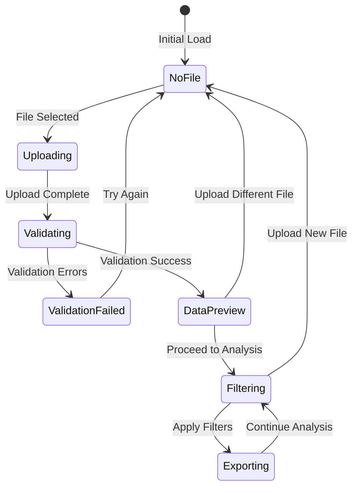

# Design Document

## Overview

The File Import Dashboard Enhancement transforms the existing Interactive Filter Dashboard into a fully self-contained application by adding comprehensive file upload, validation, and processing capabilities. The design maintains the existing filtering and export functionality while adding a robust file import workflow that handles data validation, cleaning, and user guidance. The enhancement follows a progressive disclosure pattern, guiding users through upload, validation, preview, and analysis phases.

## Architecture

### Enhanced High-Level Architecture

```
┌─────────────────────────────────────────────────────────────┐
│                    Streamlit Web Interface                  │
├─────────────────────────────────────────────────────────────┤
│  ┌─────────────┐  ┌─────────────┐  ┌─────────────┐         │
│  │   Upload    │  │   Sidebar   │  │  Main Area  │         │
│  │ Interface   │  │   Filters   │  │   Content   │         │
│  └─────────────┘  └─────────────┘  └─────────────┘         │
├─────────────────────────────────────────────────────────────┤
│                    Application Logic Layer                  │
│  ┌─────────────┐  ┌─────────────┐  ┌─────────────┐         │
│  │    File     │  │   Data      │  │   Filter    │         │
│  │ Processing  │  │ Validation  │  │   Engine    │         │
│  └─────────────┘  └─────────────┘  └─────────────┘         │
├─────────────────────────────────────────────────────────────┤
│                      Data Layer                             │
│  ┌─────────────┐  ┌─────────────┐  ┌─────────────┐         │
│  │  Uploaded   │  │  Validated  │  │  Filtered   │         │
│  │    Files    │  │    Data     │  │   Results   │         │
│  └─────────────┘  └─────────────┘  └─────────────┘         │
└─────────────────────────────────────────────────────────────┘
```

### Application State Flow



## Components and Interfaces

### File Upload Component

**Purpose**: Handle file upload, validation, and initial processing

**Key Functions**:
- `render_upload_interface()`: Display upload UI with drag-and-drop
- `validate_uploaded_file()`: Check file format, size, and structure
- `process_uploaded_file()`: Load and clean uploaded data
- `show_upload_guidance()`: Display help and examples

**Interface**:
```python
class FileUploadComponent:
    def render_upload_interface(self) -> Optional[pd.DataFrame]:
        """
        Render file upload interface with drag-and-drop
        Returns: DataFrame if file successfully processed, None otherwise
        """
    
    def validate_uploaded_file(self, uploaded_file) -> ValidationResult:
        """
        Validate uploaded file format, size, and basic structure
        Returns: ValidationResult with success status and messages
        """
    
    def process_uploaded_file(self, uploaded_file) -> ProcessingResult:
        """
        Process uploaded file with cleaning and validation
        Returns: ProcessingResult with DataFrame and processing report
        """
```

**Upload Interface Features**:
- Drag-and-drop file upload area
- File format validation (.xlsx, .xls)
- File size limits (50MB maximum)
- Progress indicators during upload and processing
- Clear error messaging with actionable guidance

### Data Validation Component

**Purpose**: Validate data structure, quality, and compatibility

**Key Functions**:
- `validate_data_structure()`: Check required columns and data types
- `suggest_column_mapping()`: Propose column name mappings
- `generate_validation_report()`: Create comprehensive validation summary
- `auto_fix_common_issues()`: Automatically resolve common data problems

**Interface**:
```python
class DataValidationComponent:
    def validate_data_structure(self, df: pd.DataFrame) -> StructureValidation:
        """
        Validate DataFrame structure against expected schema
        Returns: StructureValidation with column analysis and suggestions
        """
    
    def suggest_column_mapping(self, df_columns: List[str]) -> ColumnMapping:
        """
        Suggest mappings for non-standard column names
        Returns: ColumnMapping with suggested column name mappings
        """
    
    def generate_validation_report(self, df: pd.DataFrame) -> ValidationReport:
        """
        Generate comprehensive data quality and validation report
        Returns: ValidationReport with statistics and recommendations
        """
```

**Validation Features**:
- Required column detection
- Column name similarity matching
- Data type validation and conversion
- Missing value analysis
- Data quality scoring
- Automated fixing suggestions

### Data Preview Component

**Purpose**: Display data preview and processing results

**Key Functions**:
- `render_data_preview()`: Show sample data with statistics
- `display_processing_report()`: Show data cleaning results
- `show_column_analysis()`: Display column-by-column analysis
- `render_proceed_options()`: Provide next step options

**Interface**:
```python
class DataPreviewComponent:
    def render_data_preview(self, df: pd.DataFrame, report: ProcessingReport):
        """
        Render data preview with statistics and quality indicators
        """
    
    def display_processing_report(self, report: ProcessingReport):
        """
        Display comprehensive processing and cleaning report
        """
    
    def show_column_analysis(self, df: pd.DataFrame):
        """
        Show detailed analysis of each column
        """
```

**Preview Features**:
- First 20 rows data preview
- Column statistics and data types
- Data cleaning summary
- Quality indicators and warnings
- Processing performance metrics

### Enhanced Session Management

**Purpose**: Manage file upload state and session data

**Key Functions**:
- `initialize_upload_state()`: Set up upload-related session state
- `clear_previous_data()`: Clean up when new file uploaded
- `cache_uploaded_data()`: Efficiently cache processed data
- `manage_file_lifecycle()`: Handle temporary file cleanup

**Interface**:
```python
class SessionManager:
    def initialize_upload_state(self):
        """Initialize session state for file upload workflow"""
    
    def clear_previous_data(self):
        """Clear previous data when new file is uploaded"""
    
    def cache_uploaded_data(self, df: pd.DataFrame, metadata: dict):
        """Cache uploaded data with metadata for session"""
```

## Data Models

### File Upload State Model

```python
UploadState = {
    'file_uploaded': bool,           # Whether file has been uploaded
    'upload_status': str,            # 'none', 'uploading', 'processing', 'complete', 'error'
    'uploaded_filename': str,        # Original filename
    'file_size': int,               # File size in bytes
    'upload_timestamp': datetime,    # When file was uploaded
    'processing_time': float,       # Time taken to process file
    'validation_passed': bool,      # Whether validation was successful
    'data_loaded': bool            # Whether data is ready for filtering
}
```

### Validation Result Model

```python
ValidationResult = {
    'success': bool,                    # Overall validation success
    'errors': List[str],               # Critical errors that prevent processing
    'warnings': List[str],             # Non-critical issues
    'required_columns_found': List[str], # Required columns present
    'required_columns_missing': List[str], # Required columns missing
    'suggested_mappings': Dict[str, str], # Suggested column name mappings
    'data_quality_score': float,       # Overall data quality score (0-100)
    'row_count': int,                  # Number of data rows
    'column_count': int,               # Number of columns
    'file_info': dict                  # File metadata
}
```

### Processing Report Model

```python
ProcessingReport = {
    'original_shape': Tuple[int, int],     # Original DataFrame shape
    'final_shape': Tuple[int, int],        # Final DataFrame shape after cleaning
    'columns_cleaned': List[str],          # Columns that were cleaned
    'cleaning_stats': Dict[str, dict],     # Cleaning statistics per column
    'null_handling': Dict[str, int],       # Null values handled per column
    'type_conversions': Dict[str, str],    # Data type conversions performed
    'outliers_detected': Dict[str, int],   # Outliers detected per column
    'processing_time': float,              # Total processing time
    'memory_usage': float,                 # Memory usage in MB
    'recommendations': List[str]           # Recommendations for user
}
```

### Column Mapping Model

```python
ColumnMapping = {
    'exact_matches': Dict[str, str],       # Exact column name matches
    'fuzzy_matches': Dict[str, List[str]], # Fuzzy matches with confidence scores
    'unmapped_required': List[str],        # Required columns without matches
    'unmapped_optional': List[str],        # Optional columns without matches
    'user_mappings': Dict[str, str],       # User-specified mappings
    'confidence_scores': Dict[str, float]  # Confidence scores for mappings
}
```

## User Interface Design

### Upload Interface Layout

```
┌─────────────────────────────────────────────────────────────┐
│                    File Upload Interface                    │
├─────────────────────────────────────────────────────────────┤
│  ┌─────────────────────────────────────────────────────┐   │
│  │              Drag & Drop Upload Area                │   │
│  │                                                     │   │
│  │     📁 Drag your Excel file here or click to browse │   │
│  │                                                     │   │
│  │        Supported formats: .xlsx, .xls              │   │
│  │        Maximum size: 50MB                          │   │
│  └─────────────────────────────────────────────────────┘   │
├─────────────────────────────────────────────────────────────┤
│  Help & Examples                                            │
│  • Download sample template                                 │
│  • View required columns                                    │
│  • Common formatting tips                                   │
└─────────────────────────────────────────────────────────────┘
```

### Validation Results Layout

```
┌─────────────────────────────────────────────────────────────┐
│                   Validation Results                        │
├─────────────────────────────────────────────────────────────┤
│  ✅ File Format: Valid Excel file                          │
│  ✅ File Size: 2.3MB (within limits)                       │
│  ✅ Data Rows: 1,247 properties found                      │
│  ⚠️  Missing Columns: 2 optional columns not found         │
│  ✅ Data Quality: 87/100 (Good)                            │
├─────────────────────────────────────────────────────────────┤
│  Column Mapping Suggestions:                               │
│  • "Bldg SqFt" → "Building SqFt" (95% confidence)         │
│  • "Sale Price" → "Sold Price" (90% confidence)           │
├─────────────────────────────────────────────────────────────┤
│  [Accept Mappings] [Manual Mapping] [Upload Different File] │
└─────────────────────────────────────────────────────────────┘
```

### Data Preview Layout

```
┌─────────────────────────────────────────────────────────────┐
│                     Data Preview                            │
├─────────────────────────────────────────────────────────────┤
│  Dataset: property_data.xlsx (1,247 rows × 15 columns)     │
│  Processed in 2.3 seconds                                  │
├─────────────────────────────────────────────────────────────┤
│  [Data Table Preview - First 20 rows]                      │
│  Property Name | Property Type | City | Building SqFt...   │
│  Property A    | Industrial    | LA   | 50,000            │
│  Property B    | Warehouse     | TX   | 75,000            │
│  ...                                                       │
├─────────────────────────────────────────────────────────────┤
│  Processing Summary:                                        │
│  • 3 columns cleaned (currency/percentage formatting)      │
│  • 45 null values handled                                  │
│  • All data types validated                                │
├─────────────────────────────────────────────────────────────┤
│  [Proceed to Filtering] [View Full Report] [Upload New File]│
└─────────────────────────────────────────────────────────────┘
```

## Error Handling

### Upload Error Handling

1. **File Format Errors**: Clear messaging about supported formats with examples
2. **File Size Errors**: Guidance on reducing file size or splitting data
3. **Corrupted Files**: Instructions for file repair or re-export
4. **Network Errors**: Retry mechanisms and offline guidance
5. **Browser Compatibility**: Fallback upload methods for older browsers

### Validation Error Handling

1. **Missing Required Columns**: List missing columns with suggestions
2. **Data Type Mismatches**: Show examples of correct formats
3. **Empty Files**: Guidance on data preparation
4. **Encoding Issues**: Automatic detection and conversion attempts
5. **Memory Limitations**: Chunked processing for large files

### Processing Error Handling

1. **Memory Overflow**: Efficient processing strategies and user guidance
2. **Timeout Errors**: Progress indicators and processing optimization
3. **Data Corruption**: Partial recovery and user notification
4. **Session Timeouts**: Data persistence and recovery mechanisms
5. **Concurrent Access**: Session isolation and conflict resolution

## Security Considerations

### File Upload Security

1. **File Type Validation**: Strict whitelist of allowed file extensions
2. **Content Scanning**: Basic malware detection for uploaded files
3. **Size Limitations**: Enforce reasonable file size limits
4. **Temporary File Handling**: Secure temporary file creation and cleanup
5. **Session Isolation**: Ensure user data doesn't leak between sessions

### Data Privacy

1. **Memory Management**: Clear sensitive data from memory after processing
2. **Session Data**: Automatic cleanup of uploaded data on session end
3. **Error Logging**: Avoid logging sensitive data in error messages
4. **File Storage**: No persistent storage of uploaded files
5. **Data Transmission**: Secure handling of data during processing

## Performance Considerations

### Upload Performance

1. **Chunked Upload**: Support for large file uploads in chunks
2. **Progress Indicators**: Real-time upload progress feedback
3. **Compression**: Automatic compression for large datasets
4. **Caching Strategy**: Efficient caching of processed data
5. **Memory Management**: Streaming processing for large files

### Processing Performance

1. **Lazy Loading**: Load data progressively as needed
2. **Parallel Processing**: Multi-threaded data cleaning where possible
3. **Memory Optimization**: Efficient pandas operations and data types
4. **Caching**: Cache expensive validation and cleaning operations
5. **Resource Monitoring**: Track memory and CPU usage during processing

## Integration with Existing Dashboard

### Seamless Workflow Integration

1. **State Management**: Preserve existing session state management
2. **Filter Compatibility**: Ensure uploaded data works with all existing filters
3. **Export Enhancement**: Include upload metadata in exported files
4. **UI Consistency**: Maintain existing UI patterns and styling
5. **Performance Preservation**: No degradation of existing functionality

### Backward Compatibility

1. **Hardcoded Path Support**: Maintain support for existing file path configuration
2. **API Compatibility**: Preserve existing function signatures where possible
3. **Configuration Options**: Allow toggling between upload and hardcoded modes
4. **Migration Path**: Smooth transition for existing users
5. **Feature Flags**: Ability to enable/disable upload functionality

## Testing Strategy

### Upload Testing

1. **File Format Testing**: Test various Excel formats and versions
2. **Size Limit Testing**: Verify proper handling of size limits
3. **Error Condition Testing**: Test various error scenarios
4. **Browser Compatibility**: Test across different browsers
5. **Performance Testing**: Test with large files and slow connections

### Validation Testing

1. **Column Mapping Testing**: Test fuzzy matching algorithms
2. **Data Quality Testing**: Test with various data quality issues
3. **Edge Case Testing**: Test with empty files, single rows, etc.
4. **Format Testing**: Test with various data formats and encodings
5. **Memory Testing**: Test memory usage with large datasets

### Integration Testing

1. **End-to-End Testing**: Complete workflow from upload to export
2. **Filter Integration**: Ensure all filters work with uploaded data
3. **Export Integration**: Verify export functionality with uploaded data
4. **Session Management**: Test session state across upload workflow
5. **Error Recovery**: Test recovery from various error conditions